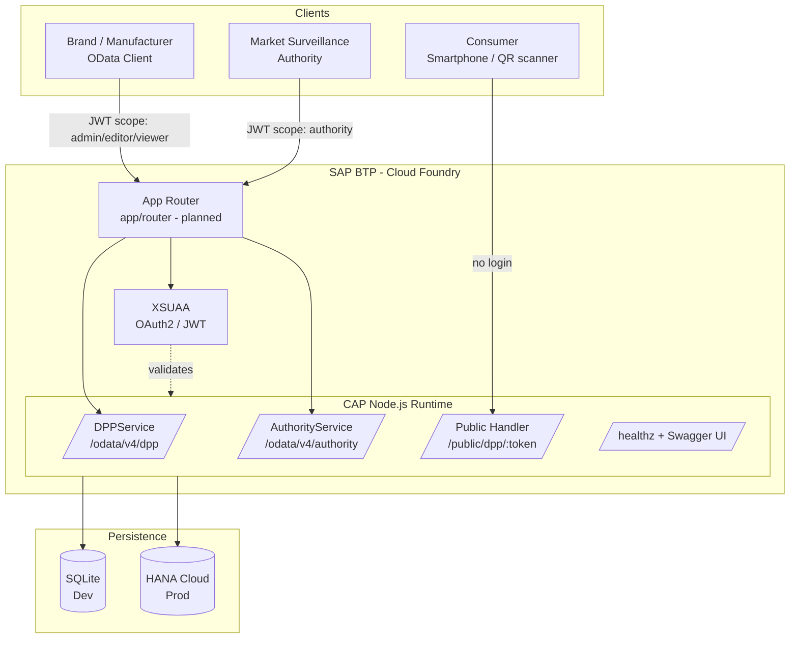
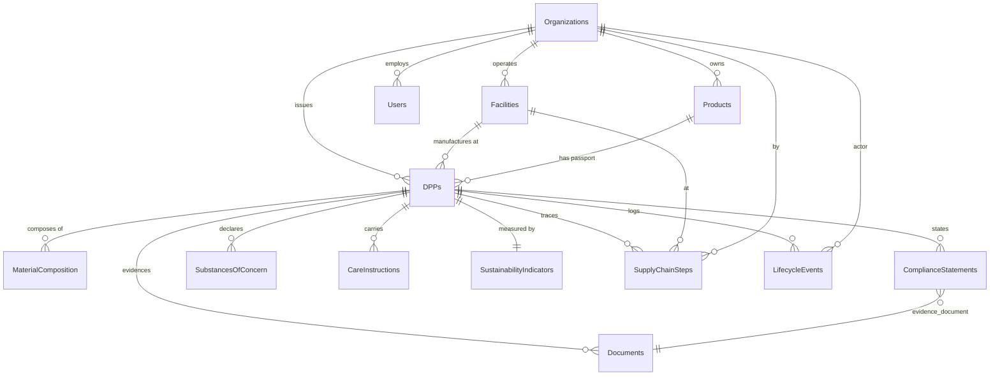
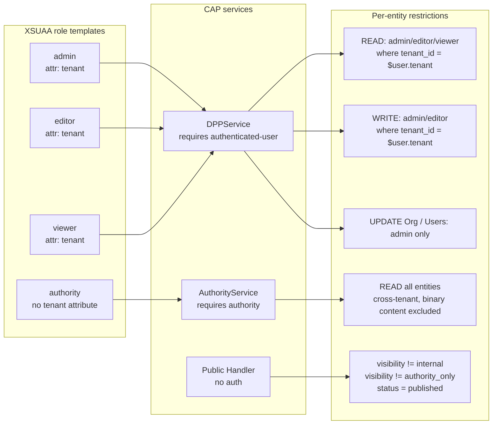
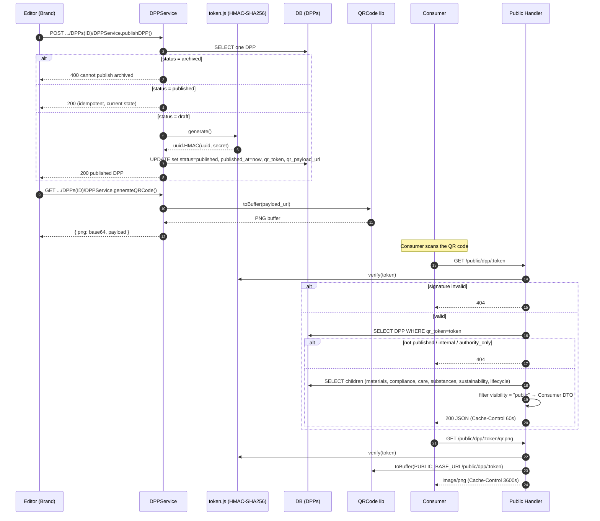

% DPP Capgemini — Technical Documentation
% Digital Product Passport Backend (Fashion)
% 2026

# Overview

The **dpp_capgemini** project is a backend for an EU-ESPR–oriented Digital Product Passport (DPP) targeted at the fashion industry. It is implemented as a TUM × Capgemini student project.

**Technology stack**

- SAP Cloud Application Programming Model (CAP), Node.js, `@sap/cds` ^9
- CDS data model, OData V4 services, auto-generated OpenAPI / Swagger
- SQLite (development) / SAP HANA Cloud (production on SAP BTP)
- XSUAA authentication with four roles: `admin`, `editor`, `viewer`, `authority`
- Public consumer endpoint (`/public/dpp/:token`, no login) with QR-code PNG generation
- Jest unit tests + `cds.test` integration tests

# 1. Technical Data Model (Data Schema)

The data model is declared in CDS (SAP Cloud Application Programming Model) and lives under `db/`. It is split into three files:

- `db/common.cds` — base types and enumerations
- `db/org.cds` — organization and user master data (tenant level)
- `db/dpp.cds` — DPP core model with composition children

## 1.1 Types and Enumerations (`common.cds`)

| Type | Definition | Purpose |
|------|------------|---------|
| `CountryISO2` | `String(2)` | ISO-3166-1 alpha-2 country code |
| `GTIN` | `String(14)` | Global Trade Item Number |
| `GLN` | `String(13)` | Global Location Number |
| `EmailAddr` | `String(254)` | RFC 5321-compliant e-mail |
| `URL` | `String(500)` | External references, QR payload |
| `Sha256Hex` | `String(64)` | Hash audit for documents |
| `OrgType` | enum | brand, manufacturer, supplier, distributor, retailer, logistics_provider, recycler, repair_service, certifier, authority |
| `DPPStatus` | enum | draft, published, superseded, archived |
| `Visibility` | enum | public, restricted, internal, authority_only |
| `Verification` | enum | declared, documented, third_party_verified |
| `Granularity` | enum | model, batch |
| `MaterialClass` | enum | natural_plant, natural_animal, synthetic, regenerated, recycled, bio_based, metal, other |
| `ComplianceStandard` | enum | ESPR, EU_Textile_Labelling, REACH, SCIP, CSDDD, CSRD, AGEC_FR, GOTS, OEKO_TEX, BLUESIGN, CRADLE_TO_CRADLE |
| `DocumentType` | enum | certificate, audit_report, test_report, declaration, safety_sheet, care_label, repair_manual |
| `UserRole` | enum | admin, editor, viewer, authority |
| `LifecycleEventType` | enum | manufactured, sold, repaired, resold, refurbished, recycled, disposed |
| `SupplyChainTier` | enum | tier1, tier2, tier3, tier4 |

The `identified` aspect provides a readable `String(36)` key instead of a UUID. This is a deliberate choice so that sample IDs such as `dpp-001` and upstream system identifiers can be kept unchanged.

## 1.2 Tenant and Master Data Entities (`org.cds`)

### Organizations

The tenant is represented by the `tenant_id` column (UNIQUE). An organization owns Facilities and Users.

| Field | Type | Constraint |
|-------|------|------------|
| ID | String(36) | Primary key |
| legal_name | String(120) | not null |
| trade_name | String(120) | |
| organization_type | OrgType | |
| country_iso2 | CountryISO2 | |
| city | String(80) | |
| gln | GLN | |
| tenant_id | String(64) | not null, UNIQUE |
| is_platform_tenant | Boolean | default false |

### Facilities

n:1 to Organizations, with geo-coordinates and audit status for tier mapping.

| Field | Type | Notes |
|-------|------|-------|
| ID | String(36) | Primary key |
| organization | Association to Organizations | not null |
| name | String(120) | not null |
| facility_type | FacilityType | |
| country_iso2 | CountryISO2 | |
| region | String(80) | |
| gln | GLN | |
| latitude | Decimal(9,6) | |
| longitude | Decimal(9,6) | |
| audit_status | AuditStatus | |
| last_audit_date | Date | |

### Users

n:1 to Organizations; UNIQUE constraint on `(email, organization)`; `external_user_id` links to the XSUAA subject.

| Field | Type | Notes |
|-------|------|-------|
| ID | String(36) | Primary key |
| email | EmailAddr | not null |
| display_name | String(120) | |
| organization | Association to Organizations | not null |
| role | UserRole | not null |
| external_user_id | String(120) | XSUAA subject mapping |

## 1.3 DPP Core Model (`dpp.cds`)

### Products

Product master data, n:1 to `owning_organization`, UNIQUE on `(gtin, owning_organization)`.

| Field | Type |
|-------|------|
| ID | String(36) |
| name | String(120) not null |
| gtin | GTIN |
| category | String(40) |
| brand | String(120) |
| description | String(500) |
| owning_organization | Association to Organizations |

### DPPs

Central entity, can be model- or batch-specific.

| Field | Type | Meaning |
|-------|------|---------|
| ID | String(36) | Primary key |
| product, issuing_organization, facility | Assoc. | References to master data |
| gtin | GTIN | Used when batch-level GTIN differs |
| granularity_level | Granularity | default `model` |
| batch_lot_number | String(40) | UNIQUE per product |
| status | DPPStatus | default `draft` |
| visibility | Visibility | default `internal` |
| verification_status | Verification | default `declared` |
| manufacturing_country_iso2 | CountryISO2 | |
| manufacturing_date_from / _to | Date | |
| placed_on_market_date | Date | |
| published_at, archived_at | Timestamp | Lifecycle markers |
| qr_token | String(128) | UNIQUE, HMAC-signed |
| qr_payload_url | URL | Consumer deep link |

### Composition children

All composition children expose a `visibility` column so that the public filter pipeline can strip non-public content.

| Entity | Purpose |
|--------|---------|
| MaterialComposition | Fibres, percentage, recycled share, country of origin |
| ComplianceStatements | Statements covering ESPR / REACH / SCIP / CSDDD / etc. including evidence document |
| Documents | Certificates and reports including `LargeBinary` content, SHA-256, MIME type |
| SubstancesOfConcern | CAS / EC numbers, SCIP reference, concentration |
| CareInstructions | Care instructions per language |
| SustainabilityIndicators | CO₂, water, energy, durability / repairability (1:1 to DPP) |
| SupplyChainSteps | Tier 1–4 step, facility, organization, time range |
| LifecycleEvents | manufactured / sold / repaired / recycled / etc. |

### Uniqueness and integrity constraints

- `Organizations.tenant_id` UNIQUE
- `Users (email, organization)` UNIQUE
- `Products (gtin, owning_organization)` UNIQUE
- `DPPs.qr_token` UNIQUE
- `DPPs (product, batch_lot_number)` UNIQUE

# 2. Architecture Diagrams

The diagrams below are provided both as Mermaid source (renders on GitHub / VS Code with the Mermaid extension) and as a textual description that remains readable inside this .docx export.

## 2.1 High-Level System Architecture

**Description.** Three client classes (internal brand users, public authority users, and anonymous consumers) connect to a CAP runtime hosted on SAP BTP Cloud Foundry. Authenticated traffic flows through the App Router and XSUAA; the public consumer route bypasses authentication and is mounted directly on the Express bootstrap. Persistence targets SQLite for local development and SAP HANA Cloud in production.



**Component responsibilities.**

- **App Router (planned)** — terminates user sessions and forwards JWTs to CAP services.
- **XSUAA** — issues OAuth2 JWTs and exposes role-template-driven scopes (`admin`, `editor`, `viewer`, `authority`).
- **DPPService** — tenant-scoped CRUD for internal users.
- **AuthorityService** — cross-tenant, read-only view for market-surveillance authorities.
- **Public Handler** — anonymous consumer route serving a visibility-filtered DTO and the QR PNG.
- **Persistence** — SQLite locally, SAP HANA Cloud in production; the CDS model is portable across both.

## 2.2 ER Diagram (Data Model)

**Description.** Organizations sit at the top of the master-data tree; they own Facilities, Users, Products, and issue DPPs. A Product has one or more DPPs (model or batch granularity). Each DPP composes eight child entity sets; `SustainabilityIndicators` is the only 1:1 relationship.



**Key entity attributes (compact view).**

- **Organizations** — `ID` (PK), `tenant_id` (UNIQUE), `legal_name`, `organization_type`, `country_iso2`, `gln`.
- **DPPs** — `ID` (PK), `product` (FK), `issuing_organization` (FK), `status`, `visibility`, `verification_status`, `granularity_level`, `batch_lot_number`, `qr_token` (UNIQUE), `qr_payload_url`, `published_at`, `archived_at`.
- **Products** — `ID` (PK), `gtin`, `owning_organization` (FK).

## 2.3 Service Architecture (Roles, Scopes, Authorization)

**Description.** Authorization is layered. The service annotation `@requires` controls who can reach the service at all; per-entity `@restrict` rules then combine the caller's role with a `where` clause that pins each query to `Organizations.tenant_id = $user.tenant`. The `authority` role is intentionally issued without a `tenant` attribute, so its queries skip the tenant filter and observe the full data set (excluding document binary content).



**Role / capability matrix.**

| Capability | admin | editor | viewer | authority | public |
|------------|-------|--------|--------|-----------|--------|
| Read DPP within own tenant | yes | yes | yes | — | — |
| Create / update / delete DPP | yes | yes | — | — | — |
| Publish / archive DPP | yes | yes | — | — | — |
| Manage Users / Organizations | yes | — | — | — | — |
| Read DPP across all tenants | — | — | — | yes | — |
| Read published, public-visible DPP via QR token | — | — | — | — | yes |

## 2.4 QR Workflow (Publish → Consumer Scan)

**Description.** When an editor publishes a DPP, the service generates an HMAC-signed token, stamps `published_at`, and stores the consumer payload URL. Calling `generateQRCode()` returns a base64 PNG of that URL. When a consumer scans the printed QR code, the public handler verifies the HMAC in constant time without touching the database, then loads the DPP and its children and emits a Consumer DTO that filters out non-public rows.



**Token format.**

```
<uuid-v4>.<base64url(HMAC-SHA256(QR_TOKEN_HMAC_SECRET, uuid))>
```

The HMAC prefix lets the public route reject forged tokens in constant time (`timingSafeEqual`) before any database lookup. Sensitive fields (tenant, hash audit, internal counters) are intentionally excluded from the Consumer DTO.

# Appendix A — Endpoints

| Method | Path | Auth | Purpose |
|--------|------|------|---------|
| GET | `/odata/v4/dpp/$metadata` | XSUAA | Tenant-scoped DPP CRUD service metadata |
| GET | `/odata/v4/authority/$metadata` | role `authority` | Read-only cross-tenant view |
| GET | `/public/dpp/:token` | none | Consumer view (visibility-filtered) |
| GET | `/public/dpp/:token/qr.png` | none | Printable QR code PNG |
| GET | `/$api-docs/odata/v4/dpp` | — | Swagger UI for the DPP service |
| GET | `/$api-docs/odata/v4/authority` | — | Swagger UI for the authority service |
| GET | `/healthz` | none | Liveness probe |

# Appendix B — Mock Users (Local Development)

Basic-Auth, password `x`.

| User | Role | Tenant |
|------|------|--------|
| alice.admin | admin | ORG-A |
| bob.editor | editor | ORG-A |
| carol.viewer | viewer | ORG-A |
| dan.editor.b | editor | ORG-B |
| eve.authority | authority | — |
